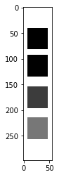
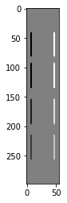
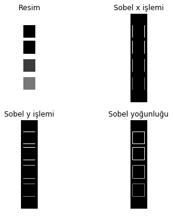
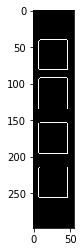
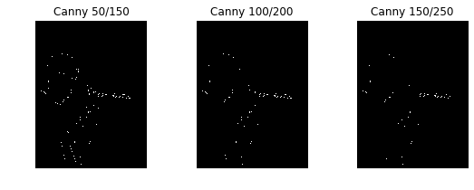
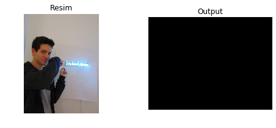

# Kenarları Algılama

Bu derste, Sobel operatörü (`cv2.Sobel()`) ve Canny edge detektörü (`cv2.Canny()`) kullanarak kenarları bulacağız.

---


```python
import numpy as np
import cv2 # OpenCV-Python
import matplotlib.pyplot as plt
```


```python
# Resmi griye çevir
input_image = cv2.imread('color.png', cv2.IMREAD_GRAYSCALE)  
print('dtype: ' + str(input_image.dtype))
print('shape: ' + str(input_image.shape))

plt.imshow(input_image, cmap='gray')  # Grafiğin gri tonlamalı olarak çizildiğinden emin olun.
```

    dtype: uint8
    shape: (298, 56)
    


    <matplotlib.image.AxesImage at 0x1fa806a3160>





---

## 1. Sobel operatörü ile kenar tespiti

`dst = cv2.Sobel(src, ddepth, dx, dy, ksize=3, scale=1.0)`

- `src`: resim
- `ddepth`: çıktı resim derinliği
- `dx`: türevin x sırası
- `dy`: türev sırası y
- `ksize`: genişletilmiş Sobel çekirdeğinin büyüklüğü; 1, 3, 5 veya 7 olmalıdır
- `scale`: hesaplanan türev değerleri için isteğe bağlı ölçek faktörü


```python
ddepth = cv2.CV_64F  # 64-bit float çıkışı
dx = 1  # X yönünde birinci dereceden türev
dy = 0  # Y yönünde NO türevi
sobelx = cv2.Sobel(input_image, ddepth, dx, dy)

plt.imshow(sobelx, cmap='gray')
```


    <matplotlib.image.AxesImage at 0x1fa806d76d8>





```python
# sobel işlemleri ve büyüklükleri
sobelx = cv2.Sobel(input_image, cv2.CV_64F, 1, 0)
sobely = cv2.Sobel(input_image, cv2.CV_64F, 0, 1)
sobel = cv2.sqrt(cv2.addWeighted(cv2.pow(sobelx, 2.0), 1.0, cv2.pow(sobely, 2.0), 1.0, 0.0))

plt.figure(figsize=(6, 6));
plt.subplot(2, 2, 1); plt.title('Resim'); plt.axis('off');
plt.imshow(input_image, cmap='gray');
plt.subplot(2, 2, 2); plt.title('Sobel x işlemi'); plt.axis('off');
plt.imshow(cv2.absdiff(sobelx, 0.0), cmap='gray')
plt.subplot(2, 2, 3); plt.title('Sobel y işlemi'); plt.axis('off');
plt.imshow(cv2.absdiff(sobely, 0.0), cmap='gray');
plt.subplot(2, 2, 4); plt.title('Sobel yoğunluğu'); plt.axis('off');
plt.imshow(sobel, cmap='gray');
```





---

## 2. Canny Kenar Tespiti

`edges = cv2.Canny(image, threshold1, threshold2, apatureSize=3, L2gradient=False)`

- `image`: 8 bit gri tonlamalı giriş görüntüsü
- `eşik1` / `eşik2`: histerez prosedürü için eşikler
- `apertureSize`:` Sobel () `operatörü için açıklık boyutu
- 'L2gradient': Bir bayrak. 'Doğru', $ L_2 $ - degradelerin normunu kullanır. $ L_1 $ - "Yanlış" için normal


```python
# Canny kenar tespiti
threshold1 = 100
threshold2 = 200
canny = cv2.Canny(input_image, threshold1, threshold2)

plt.imshow(canny, cmap='gray')
```


    <matplotlib.image.AxesImage at 0x1fa805d7e10>





```python
# Çeşitli eşikler ile kenar tespitleri
canny1 = cv2.Canny(input_image, 50, 150)
canny2 = cv2.Canny(input_image, 100, 200)
canny3 = cv2.Canny(input_image, 150, 250)

plt.figure(figsize=(9, 3));
plt.subplot(1, 3, 1); plt.title('Canny 50/150'); plt.axis('off');
plt.imshow(canny1, cmap='gray');
plt.subplot(1, 3, 2); plt.title('Canny 100/200'); plt.axis('off');
plt.imshow(canny2, cmap='gray');
plt.subplot(1, 3, 3); plt.title('Canny 150/250'); plt.axis('off');
plt.imshow(canny3, cmap='gray');
```





---

## Uygulama: Kenar Tespiti

** Canny kenar tespiti ** kullanarak aşağıdaki görüntünün kenarlarını bulun.
- Giriş görüntüsünü gri tonlamaya dönüştürün.
- Hysteresys eşiklerinin uygun değerlerini seçebilirsiniz.
- `plt.imshow ()` ile gösterildiğinde `cmap = 'grey' olarak ayarlayın


```python
# Resmimiz burada
image = cv2.imread('enis.jpeg', cv2.IMREAD_COLOR)

# Cv2.Canny () yöntemini kullanarak kenarları bulmak için kodu yazın.
# ============ BURAYA KODUNUZ ============
output = np.zeros((360, 480), np.uint8)  # DUMMY
# ========================================

plt.figure(figsize=(8, 3));
plt.subplot(1, 2, 1); plt.title('Resim'); plt.axis('off');
plt.imshow(cv2.cvtColor(image, cv2.COLOR_BGR2RGB));
plt.subplot(1, 2, 2); plt.title('Output'); plt.axis('off');
# ======= BURAYAYA OUTPUTUNUZ =======
plt.imshow(output, cmap='gray');  # DUMMY
# ========================================
```





