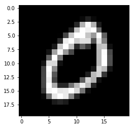
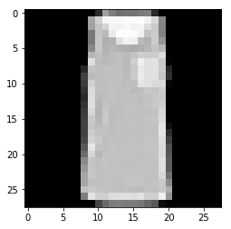

# Makine Öğrenimi

## Görüntü Sınıflandırması İçin Makine Öğrenmesi

İçinde görüntü sınıflandırma için bazı makine öğrenme algoritmaları sunuyoruz.

## k-Nearest Neighbors

kNN, sınıflandırma için veri noktaları arasındaki mesafelere bağlı olan basit bir makine öğrenme algoritmasıdır. Mesafeler genellikle Manhattan mesafesi veya Öklid mesafesi kullanılarak ölçülür.

### MNIST Veri Kümesit

MNIST veri kümesini `cv2.imread ()` kullanarak yüklüyoruz.

```python
import cv2
import numpy as np
```

```python
# Dataseti yükle
mnist = cv2.imread('./datasets/digits.png', 0)
```

```python
features = np.array([np.hsplit(row, 100) for row in np.vsplit(mnist, 50)], dtype=np.float32)
```

```python
features.shape
```

```text
(50, 100, 20, 20)
```

```python
# görselleştirme için
import matplotlib.pyplot as plt
```

```python
plt.imshow(features[0, 0], cmap='gray')
plt.show()
```



### Veri Kümesi Bölümü

Aritmetik rahatlık için veri setini 50 / 50'ye bölün.

```python
train_features = features[:, :50].reshape(-1, (20 * 20))
test_features = features[:, 50:100].reshape(-1, (20 * 20))
```

```python
k = np.arange(10)
train_labels = np.repeat(k, 250).reshape(-1, 1)
test_labels = train_labels.copy()
```

### kNN Modeli

`Cv2.ml.KNearest_create ()` kullanarak kNN modelini oluşturalım.

```python
model = cv2.ml.KNearest_create()
```

#### KNN'nin eğitimi

Aslında sadece veri noktalarını ezberliyor.

```python
model.train(train_features, cv2.ml.ROW_SAMPLE, train_labels)
```

```text
True
```

#### Daha Önceden eğitilmiş KNN modeli kullanırken

Eğitimli kNN modelini kullanarak test özelliklerini sınıflandırabilir.

```python
# k = 3
ret, result, neighbors, dist = model.findNearest(test_features, 3)
```

#### Model Doğruluğu ölçmek

Eğitimli kNN modelinin test doğruluğunu alın.

```python
# sonuçların doğru olup olmadığını kontrol edin
matches = np.equal(result, test_labels)

# bool'u int'ye çevir
matches = matches.astype(np.int)

# doğru tahminleri say
correct = np.count_nonzero(matches)

# doğruluğu hesaplamak
accuracy = (correct * 100.00) / result.size
```

```python
# test doğruluğunu görüntülem
print('Doğruluk: {}'.format(accuracy))
```

```text
Accuracy: 91.64
```

### Fashion-MNIST Veri Seti

Fashion-MNIST veri kümesi, MNIST'e bir alternatif olarak sunuldu. Fashion-MNIST veri setimizde satır başına 30 resim ve sütun başına 30 resim bulunmaktadır.

```python
# Veri Setini yükle
fashion = cv2.imread('./datasets/fashion.png', 0)
```

```python
fashion.shape
```

```text
(840, 840)
```

Veri kümesinin `840x840` boyutunda ve veri kümesindeki `30x30` boyutunda, her bir görüntünün `28x28` piksel değerine sahip olduk.

```python
features = np.array([np.hsplit(row, 30) for row in np.vsplit(fashion, 30)], dtype=np.float32)
```

```python
features.shape
```

```text
(30, 30, 28, 28)
```

```python
plt.imshow(features[0, 0], cmap='gray')
plt.show()
```



### Veri seti parçalama

Aritmetik rahatlık için veri setini 50 / 50'ye bölün.

```python
train_features = features[:, :15].reshape(-1, (28 * 28))
test_features = features[:, 15:30].reshape(-1, (28 * 28))
```

```python
k = np.arange(10)
train_labels = np.repeat(k, 45).reshape(-1, 1)
test_labels = train_labels.copy()
```

### kNN Modeli

`Cv2.ml.KNearest_create()` kullanarak kNN modelini oluşturalım.

```python
model = cv2.ml.KNearest_create()
```

#### KNN'nin eğitimi

Aslında sadece veri noktalarını ezberliyor.

```python
model.train(train_features, cv2.ml.ROW_SAMPLE, train_labels)
```

```text
True
```

#### Daha Önceden eğitilmiş KNN modeli kullanırken

Eğitimli kNN modelini kullanarak test özelliklerini sınıflandırabilir.

```python
#  k = 3
ret, result, neighbors, dist = model.findNearest(test_features, 3)
```

#### Model Doğruluğu ölçmek

Eğitimli kNN modelinin test doğruluğunu alın.

```python
# sonuçların doğru olup olmadığını kontrol edin
matches = np.equal(result, test_labels)

# bool'u int'ye çevir
matches = matches.astype(np.int)

# doğru tahminleri say
correct = np.count_nonzero(matches)

# doğruluğu hesaplamak
accuracy = (correct * 100.00) / result.size
```

```python
# test doğruluğunu görüntüle
print('Doğruluk: {}'.format(accuracy))
```

```text
Accuracy: 70.88888888888889
```

## Destek Vektör Makinesi

Veri kümesini en iyi şekilde iki sınıfa ayıran hiper düzlemi bulur.

### MNIST Veri seti

```python
# Veri setini yükle
mnist = cv2.imread('./datasets/digits.png', 0)
```

```python
features = np.array([np.hsplit(row, 100) for row in np.vsplit(mnist, 50)], dtype=np.float32)
```

```python
features.shape
```

```text
(50, 100, 20, 20)
```

### Veri Seti Parçalamak

Aritmetik rahatlık için veri setini 50 / 50'ye bölün.

```python
train_features = features[:, :50].reshape(-1, (20 * 20))
test_features = features[:, 50:100].reshape(-1, (20 * 20))
```

```python
k = np.arange(10)
train_labels = np.repeat(k, 250).reshape(-1, 1)
test_labels = train_labels.copy()
```

### SVM Modeli

```python
model = cv2.ml.SVM_create()
```

```python
model.setKernel(cv2.ml.SVM_LINEAR)
model.setC(2.67)
model.setGamma(5.383)
model.setType(cv2.ml.SVM_C_SVC)
```

#### SVM eğitimi

```python
model.train(train_features, cv2.ml.ROW_SAMPLE, train_labels)
```

```text
True
```

#### Eğitilmiş SVM'yi kullanmak

```python
result = model.predict(test_features)
```

#### Model Doğruluğunu ölçmek

Eğitimli SVM modelinin test doğruluğunu alın.

```python
matches = np.equal(result[1], test_labels)
matches = matches.astype(np.int)
correct = np.count_nonzero(matches)
accuracy = (correct * 100.00) / result[1].size
```

```python
print('Doğruluk : {}'.format(accuracy))
```

```text
Accuracy : 90.44
```

